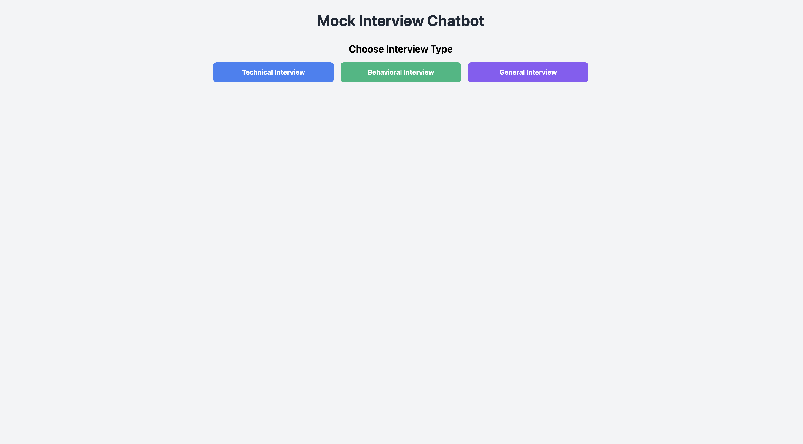
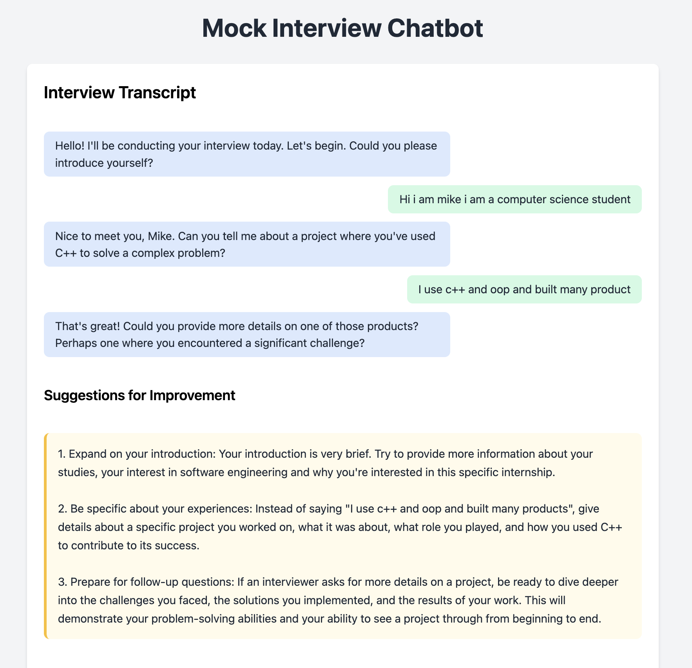
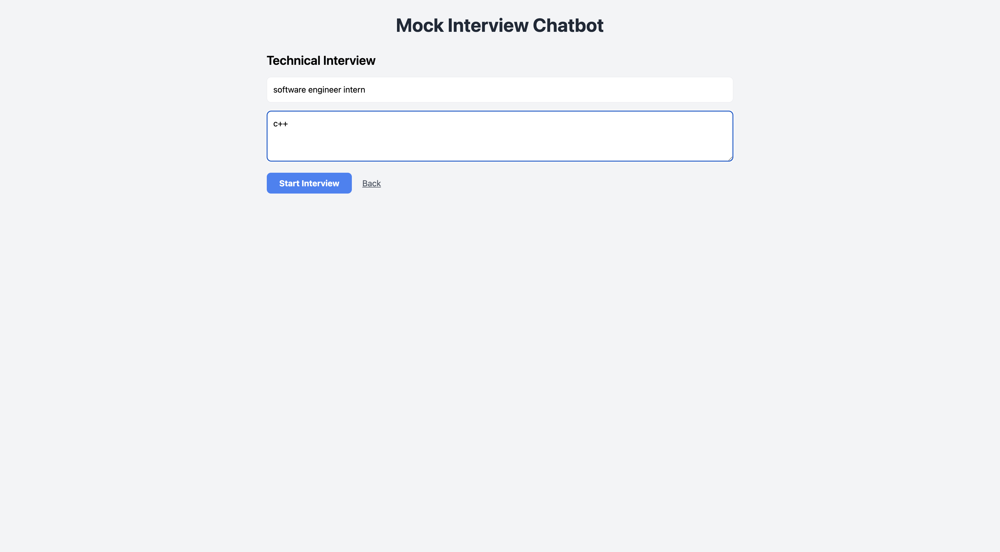

# 🎯 AI-Powered Mock Interview Chatbot

<div align="center">


**A sophisticated AI-powered interview preparation platform featuring both web and CLI interfaces, designed to help job seekers excel in their interviews through personalized practice sessions and intelligent feedback.**

[🚀 Live Demo](#-quick-start) • [📖 Documentation](#-features) • [🛠️ Installation](#-installation) • [💡 Usage](#-usage)

</div>

---

## 🌟 Project Overview

This project demonstrates advanced full-stack development skills by combining **AI/ML integration**, **modern web technologies**, and **user experience design** to solve a real-world problem. The application leverages OpenAI's GPT-4 to provide intelligent, context-aware interview questions and feedback, making it an excellent showcase of technical proficiency and practical problem-solving abilities.

### 🎯 Key Highlights

- **🤖 AI Integration**: Seamless OpenAI GPT-4 integration for intelligent conversation
- **🌐 Full-Stack Development**: Modern Flask backend with responsive frontend
- **💻 Dual Interface**: Both web application and command-line interface
- **🎨 Modern UI/UX**: Clean, professional design with real-time chat interface
- **🔧 Production Ready**: Proper error handling, environment configuration, and security practices

---

## 📸 Screenshots

<div align="center">

### 🏠 Homepage Interface

*Clean, professional landing page with interview type selection*

### 💬 Interactive Chat Interface

*Real-time conversation with AI interviewer*

### 📊 Sample Answer Analysis

*Detailed feedback and sample answers provided after each session*

### 💡 Intelligent Suggestions

*AI-powered improvement suggestions and tips*

### ⚙️ Interview Customization Panel

*Personalized interview setup with role and skill selection*

</div>

---

## ✨ Features

### 🎯 **Core Functionality**
- **Multi-Format Interviews**: Technical, Behavioral, and General interview types
- **Personalized Questions**: Job-specific customization with role and skill-based question generation
- **Real-Time Feedback**: Instant responses and suggestions during the interview
- **Sample Answers**: AI-generated example responses for learning
- **Session Analysis**: Comprehensive feedback and improvement recommendations

### 🛠️ **Technical Features**
- **RESTful API**: Clean Flask backend with proper error handling
- **Real-Time Communication**: WebSocket-like experience with AJAX
- **Responsive Design**: Mobile-friendly interface with modern CSS
- **Environment Configuration**: Secure API key management
- **Cross-Platform**: Works on Windows, macOS, and Linux

### 🔒 **Security & Best Practices**
- **API Key Protection**: Environment variables for sensitive data
- **Input Validation**: Proper sanitization and error handling
- **CORS Configuration**: Secure cross-origin resource sharing
- **Git Best Practices**: Comprehensive .gitignore and clean commit history

---

## 🚀 Quick Start

### Prerequisites
- Python 3.8 or higher
- OpenAI API key
- Modern web browser

### Installation

1. **Clone the repository**
   ```bash
   git clone https://github.com/trxu05/mock-interview-chatbot.git
   cd mock-interview-chatbot
   ```

2. **Install dependencies**
   ```bash
   pip install -r requirements.txt
   ```

3. **Configure environment**
   ```bash
   cp env.example .env
   # Edit .env and add your OpenAI API key
   ```

4. **Run the application**
   ```bash
   # Web interface
   python app.py

   # Command-line interface
   python interview_bot.py
   ```

5. **Access the application**
   - Web: http://localhost:5050
   - CLI: Follow the interactive prompts

---

## 💡 Usage

### 🌐 Web Interface
1. **Select Interview Type**: Choose from Technical, Behavioral, or General
2. **Customize Your Interview**: 
   - Enter your specific job title (e.g., "Software Engineer Intern")
   - Select relevant skills/technologies (e.g., "C++", "Python", "React")
   - Configure interview parameters for personalized questions
3. **Start Interview**: Begin your practice session with the AI interviewer
4. **Real-Time Interaction**: Type responses and receive immediate feedback
5. **Get Analysis**: End the session to receive comprehensive feedback and sample answers

### 💻 Command-Line Interface
1. **Launch CLI**: Run `python interview_bot.py`
2. **Choose Format**: Select your preferred interview type
3. **Interactive Session**: Respond to questions in the terminal
4. **Receive Feedback**: Get suggestions and tips throughout the session
5. **End Gracefully**: Type 'quit', 'exit', or 'end' to finish

---

## 🏗️ Architecture

### Backend (Flask)
- **app.py**: Main Flask application with API endpoints
- **interview_bot.py**: CLI interface with shared logic
- **Environment Management**: Secure configuration handling

### Frontend (HTML/CSS/JavaScript)
- **index.html**: Modern, responsive user interface
- **styles.css**: Professional styling with CSS Grid and Flexbox
- **app.js**: Dynamic frontend logic with AJAX communication

### AI Integration
- **OpenAI GPT-4**: Advanced language model for intelligent conversations
- **Context Management**: Maintains conversation state and context
- **Response Processing**: Intelligent parsing and formatting of AI responses

---

## 🔧 Technical Stack

| Component | Technology | Purpose |
|-----------|------------|---------|
| **Backend** | Python 3.8+ | Core application logic |
| **Web Framework** | Flask 2.0+ | RESTful API and web server |
| **AI/ML** | OpenAI GPT-4 | Intelligent conversation and feedback |
| **Frontend** | HTML5, CSS3, JavaScript | User interface and interactions |
| **Styling** | Custom CSS | Modern, responsive design |
| **Version Control** | Git | Source code management |

---

## 📁 Project Structure

```
mock-interview-chatbot/
├── 📄 app.py                 # Flask web application
├── 📄 interview_bot.py       # Command-line interface
├── 📄 requirements.txt       # Python dependencies
├── 📄 .gitignore            # Git ignore rules
├── 📄 env.example           # Environment variables template
├── 📁 static/               # Web application assets
│   ├── 📄 index.html        # Main HTML file
│   ├── 📄 styles.css        # CSS styles
│   └── 📄 app.js            # Frontend JavaScript
├── 📁 images/               # Project screenshots
│   ├── 🖼️ homepage.png
│   ├── 🖼️ chat interface.png
│   ├── 🖼️ sample answer.png
│   ├── 🖼️ suggestion.png
│   └── 🖼️ info.png
└── 📄 README.md             # Project documentation
```

---

## 🎯 Key Learning Outcomes

This project demonstrates proficiency in:

- **🤖 AI/ML Integration**: Working with OpenAI's API and GPT-4
- **🌐 Full-Stack Development**: Complete web application development
- **💻 Backend Development**: RESTful API design with Flask
- **🎨 Frontend Development**: Modern HTML, CSS, and JavaScript
- **🔧 DevOps Practices**: Environment management and deployment
- **📚 Documentation**: Professional README and code documentation
- **🛡️ Security**: API key protection and input validation
- **📱 User Experience**: Intuitive interface design and user flow

---

## 🚀 Future Enhancements

- [ ] **User Authentication**: Login system and user profiles
- [ ] **Interview History**: Save and review past sessions
- [ ] **Advanced Analytics**: Detailed performance metrics
- [ ] **Voice Integration**: Speech-to-text and text-to-speech
- [ ] **Mobile App**: React Native or Flutter application
- [ ] **Database Integration**: Persistent storage for user data
- [ ] **Multi-language Support**: Internationalization features

---

## 🤝 Contributing

Contributions are welcome! Please feel free to submit a Pull Request. For major changes, please open an issue first to discuss what you would like to change.

1. Fork the repository
2. Create your feature branch (`git checkout -b feature/AmazingFeature`)
3. Commit your changes (`git commit -m 'Add some AmazingFeature'`)
4. Push to the branch (`git push origin feature/AmazingFeature`)
5. Open a Pull Request

---

## 📄 License

This project is licensed under the MIT License - see the [LICENSE](LICENSE) file for details.

---

## 📞 Contact

**Project Link**: [https://github.com/trxu05/mock-interview-chatbot](https://github.com/trxu05/mock-interview-chatbot)

---

<div align="center">

**⭐ If you found this project helpful, please give it a star! ⭐**

*Built with ❤️ by [Your Name]*

</div>